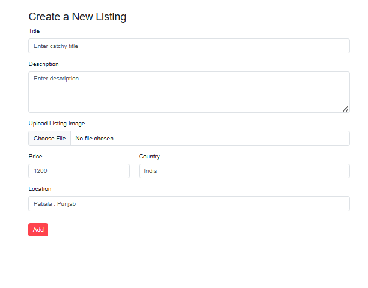
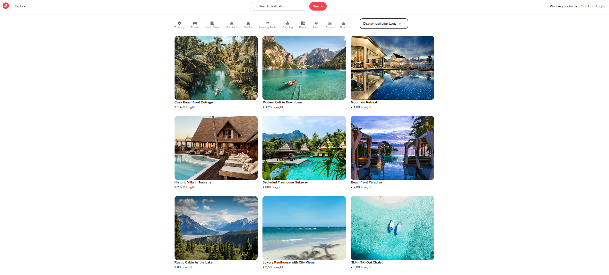
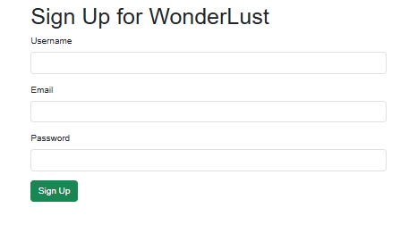
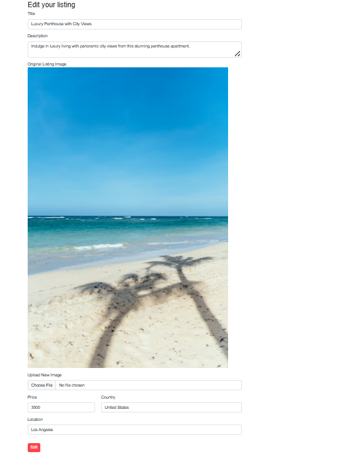
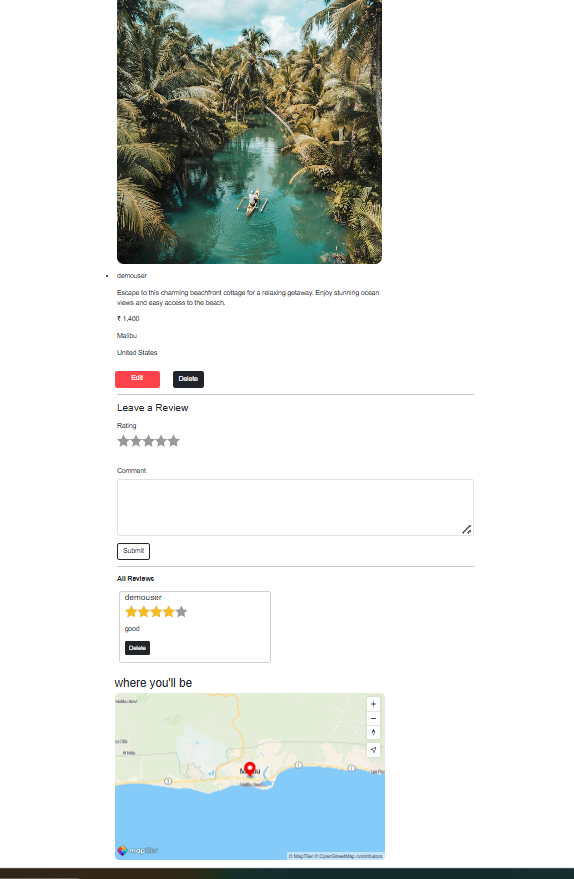

# Airbnb Clone 🏡

A full-stack Airbnb clone where users can browse listings, book stays, and host properties.

## 🛠 Tech Stack
- Frontend: JavaScript
- Backend: Node.js / Express
- Database: MongoDB
- Styling: Bootstrap CSS

  ## ✨ Features
- User authentication (login/signup)
- Create, Edit, Delete listings
- View listing details
- Flash Messages and validation
- Responsive design
- Reviews and Ratings
- Map Integration
- Image uploads

## ⚙️ Installation

1. Clone the repo
## ⚙️ Installation

1. Clone the repo
git clone https://github.com/rahu1113/airbnb-clone.git

2. Go to project folder
cd airbnb-clone

3. Install dependencies
npm install

4. Start the server
  node app.js

5. Open in browser
   http://localhost:8080/listings

## Screenshots

* Future imporvements
  Payment Integration

🔥 Author
   Rahul
